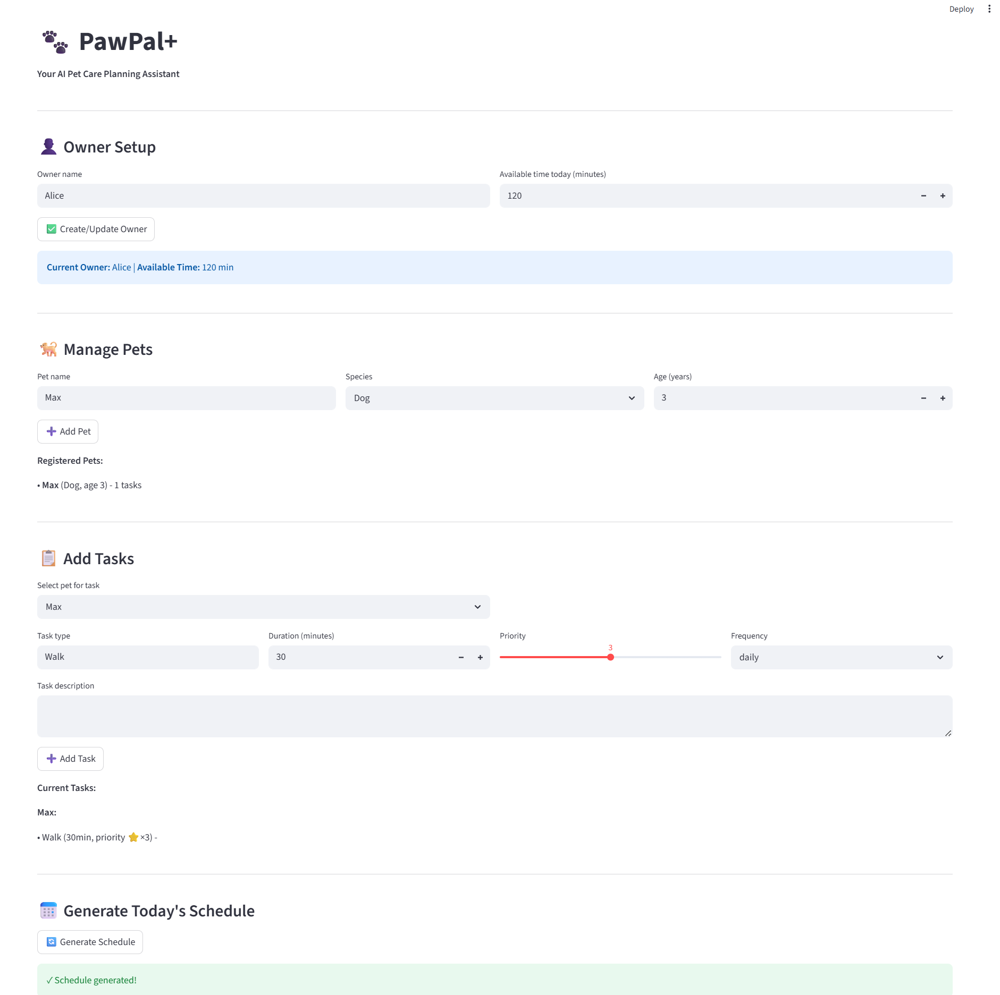

# PawPal+ — AI-Powered Pet Care Scheduler

**A Streamlit application that intelligently schedules pet care tasks based on priorities, time constraints, and recurring patterns.**

PawPal+ helps busy pet owners create optimized daily schedules for their pets by considering task duration, priority levels, frequency patterns, and potential scheduling conflicts. The system uses advanced algorithms to maximize task completion while respecting time constraints.

---

## Features

### 1. **Priority-Based Task Ranking**
- Tasks are sorted by priority (1-5 scale) with secondary sorting by duration
- High-priority tasks are always scheduled first
- Generates human-readable reasoning for scheduling decisions
- **Algorithm:** Greedy sorting with multi-key comparison

### 2. **Intelligent Time-Based Bin Packing**
- Maximizes the number of tasks that fit within available time
- Uses a greedy algorithm to fit high-priority tasks first
- Automatically calculates remaining time and skipped tasks
- **Algorithm:** Greedy bin-packing with constraint satisfaction

### 3. **Recurring Task Auto-Generation**
- Automatically creates next occurrences of daily/weekly tasks
- Tracks completion status with `last_completed` dates
- Prevents duplicate task scheduling
- **Algorithm:** Frequency-based recurrence with timedelta calculations
- **Supported Frequencies:** Daily, Weekly, As-needed, Once

### 4. **Conflict Detection & Warnings**
- Detects overlapping time slots for the same pet
- Identifies cross-pet owner conflicts (can't do two things simultaneously)
- Generates non-blocking warnings (doesn't crash, just alerts)
- Prevents pet-specific multi-tasking conflicts
- **Algorithm:** O(n²) interval overlap detection with smart grouping

### 5. **Time-of-Day Categorization**
- Automatically categorizes tasks as Morning / Afternoon / Evening
- Uses keyword matching on task type and description
- Enables time-aware scheduling blocks
- **Example:** "Morning Walk" → scheduled 7am-12pm; "Dinner Prep" → scheduled 5pm-10pm

### 6. **Recurring Task Expansion**
- Expands recurring patterns into individual task instances
- Projects recurring tasks across multiple days ahead
- Preserves task metadata (priority, duration, dependencies)
- **Algorithm:** Cartesian expansion with frequency-based recurrence

### 7. **Task Dependency Resolution**
- Honors task dependencies (e.g., "Feed pet" before "Play time")
- Uses topological sorting to order tasks correctly
- Detects circular dependencies
- **Algorithm:** Topological sorting (Kahn's algorithm variant)

### 8. **Smart Time-Slot Assignment**
- Assigns specific start times to tasks (not just order)
- Manages transition buffers between tasks
- Respects preferred time windows (preferred_times)
- Organizes into morning/afternoon/evening blocks
- **Algorithm:** Constraint-based scheduling with interval management

### 9. **Completion Tracking & Analytics**
- Tracks task status: scheduled, completed, skipped
- Calculates completion percentage
- Auto-generates next occurrences when tasks are marked complete
- Maintains plan history for past analysis
- **Metrics:** Duration tracking, completion rate, buffer time calculation

### 10. **Multi-Pet Aggregation**
- Manages multiple pets under one owner
- Retrieves and schedules tasks across all pets
- Bidirectional ownership lookup (pet ↔ task)
- Prevents pet-specific scheduling conflicts
- **Query Methods:** `get_all_tasks()`, `get_tasks_for_pet()`, `get_pet_for_task()`

---

## System Architecture

### Class Hierarchy

```
Owner (manages multiple pets & preferences)
  ├── Pet (represents a pet with special needs)
  │   └── Task (individual care activity)
  │       ├── TimeSlot (preferred scheduling window)
  │       └── Task.depends_on (dependency graph)
  ├── DailyPlan (scheduled output for one day)
  │   ├── scheduled_tasks
  │   ├── completed_tasks
  │   ├── skipped_tasks
  │   └── next_occurrences
  └── Scheduler (brain: organizes and optimizes)
```

### Key Data Structures

- **Task**: Attributes include priority (1-5), duration (minutes), frequency, last_completed date, preferred time slots, and dependencies
- **DailyPlan**: Tracks scheduled/completed/skipped tasks, total time, reasoning, and conflicts
- **Owner**: Manages pets, preferences, and plan history
- **Scheduler**: Stateless scheduling logic; generates plans on demand

---

## Getting Started

### Setup

```bash
# Create and activate virtual environment
python -m venv .venv
source .venv/bin/activate  # Windows: .venv\Scripts\activate

# Install dependencies
pip install -r requirements.txt
```

### Run the App

```bash
streamlit run app.py
```

Visit `http://localhost:8501` in your browser.

---

## Usage Workflow

### 1. Create Owner & Set Constraints
- Enter owner name and available time (minutes per day)
- Owner data persists in `st.session_state` across reruns

### 2. Register Pets
- Add pets with species, age, and special needs
- Track individual pet requirements

### 3. Add Tasks
- Specify task type, duration, priority (1-5), frequency
- Add descriptions and optional time preferences
- Tasks automatically associate with selected pet

### 4. Generate Schedule
- Click "Generate Schedule" to create daily plan
- System retrieves all tasks, ranks by priority, fits in available time
- Displays scheduled tasks with timing and explanations

### 5. Track Completion
- Mark tasks as complete to update status
- Auto-generates next occurrence for daily/weekly tasks
- View completion percentage and warnings

---

## Algorithm Details

### Priority Ranking + Bin Packing
```
rank(tasks) → sort by (-priority, duration)
fit(ranked_tasks, available_time):
    fitted = []
    total = 0
    for task in ranked_tasks:
        if total + task.duration ≤ available_time:
            fitted.append(task)
            total += task.duration
    return fitted
```

### Conflict Detection
```
for each time_slot in schedule:
    tasks_at_slot = tasks where start_time ≤ time_slot < end_time
    if len(tasks_at_slot) > 1:
        if same_pet(tasks_at_slot):
            → warning: "Pet has multiple tasks"
        else:
            → warning: "Owner conflict"
```

### Recurring Task Generation
```
next_occurrence = copy(task)
if task.frequency == "daily":
    next_occurrence.last_completed = today + 1 day
elif task.frequency == "weekly":
    next_occurrence.last_completed = today + 7 days
```

---

## Project Structure

```
pawpal-starter/
├── pawpal_system.py       # Core logic: Task, Pet, Owner, Scheduler, DailyPlan
├── app.py                 # Streamlit UI with st.session_state integration
├── main.py                # Standalone testing script
├── tests/
│   └── test_pawpal.py     # Unit tests for core behaviors
├── requirements.txt       # Dependencies (streamlit, pytest, etc.)
└── README.md              # This file
```

---

## Testing

Run tests to verify scheduling behaviors:

```bash
pytest tests/ -v
```

**Test Coverage:**
- Task completion marking
- Pet task aggregation
- Mandatory task detection (frequency-based)
- Schedule feasibility
- Conflict detection

---

## Session State Management

The app uses Streamlit's `st.session_state` for persistence:

```python
# Check if object exists before creating
if "owner" not in st.session_state:
    st.session_state.owner = Owner(name, available_time)

# Access persisted object across reruns
current_owner = st.session_state.owner
```

**Persisted Objects:**
- `owner`: Single Owner instance per session
- `scheduler`: Associated Scheduler
- `current_plan`: Today's generated DailyPlan

---

## Design Decisions & Tradeoffs

### 1. **Greedy Bin Packing vs. Optimal Packing**
- **Tradeoff:** Greedy is O(n log n) but may not pack optimally; optimal is NP-hard
- **Decision:** Greedy provides good results with instant feedback for real-time UX

### 2. **Non-Blocking Warnings vs. Hard Failures**
- **Tradeoff:** Warnings allow schedules with conflicts; hard failures prevent them
- **Decision:** Warnings give owner visibility without blocking valid schedules

### 3. **Auto-Recurrence vs. Manual Recurrence Entry**
- **Tradeoff:** Auto-recurrence reduces UI friction; manual is more explicit
- **Decision:** Auto-recurrence at task completion time improves UX

### 4. **Shared Task Objects vs. Task Instances**
- **Tradeoff:** Shared objects save memory; instances provide isolation
- **Decision:** Task objects are mutable but isolated per DailyPlan (no global state pollution)

---

## Future Enhancements

- [ ] **Machine learning preference detection** — Learn optimal task ordering from past completions
- [ ] **Multi-day planning** — Generate week/month views with recurring task expansion
- [ ] **Notification system** — Remind owner of upcoming tasks via email/SMS
- [ ] **Vet appointment integration** — Block calendar for medical needs
- [ ] **Pet health tracking** — Log medication compliance, feeding amounts
- [ ] **Collaborative scheduling** — Multi-owner/caregiver support
- [ ] **Advanced preferences** — Temperature-based scheduling (e.g., walks in cooler hours)

---

## Project Reflection

This project demonstrates:
- **System design**: UML → Python classes → Streamlit UI
- **Algorithm implementation**: Sorting, bin-packing, conflict detection, topological sorting
- **Constraint satisfaction**: Time, priority, frequency, dependencies
- **State management**: Session persistence across UI reruns
- **Edge case handling**: Circular dependencies, overlapping times, recurring patterns

See `reflection.md` for detailed design decisions and AI collaboration notes.

---

## Requirements

- Python 3.8+
- Streamlit
- pytest (for testing)

Install all dependencies:
```bash
pip install -r requirements.txt
```

---

## Author Notes

Built for AI110 Module 2 Project. Demonstrates practical application of:
- Object-oriented design principles
- Algorithm design and optimization
- Interactive UI development with Streamlit
- Test-driven development practices
- AI-assisted system design and debugging

**1. Intelligent Task Sorting**
- Tasks ranked by priority (5-star scale) with secondary sorting by duration
- Out-of-order task inputs automatically reorganized by importance
- Ensures high-priority tasks (meds, feeding) always get scheduled first

**2. Flexible Filtering & Organization**
- Filter tasks by pet, type, or mandatory/optional status
- Time-of-day categorization (morning/afternoon/evening) for logical grouping
- Pet-specific task lists with automatic relationship tracking

**3. Recurring Task Management**
- Auto-expansion of daily/weekly recurring tasks into future occurrences
- Automatic recurrence generation using Python's `timedelta` (e.g., daily tasks generate next occurrence for tomorrow)
- Seamless task regeneration on completion without manual intervention

**4. Lightweight Conflict Detection**
- Non-blocking detection of scheduling conflicts (same-time overlaps, same-pet conflicts)
- Returns clear warning messages without crashing the program
- Identifies cross-pet conflicts (owner can't do two pets' tasks simultaneously)
- Time-aware conflict messages show exact overlap times (HH:MM format)

**5. Time-Aware Scheduling**
- Smart slot assignment that respects time-of-day preferences
- Organizes tasks into morning (7am-12pm), afternoon (12pm-5pm), evening (5pm-10pm) blocks
- Automatic buffer calculation between tasks (default 10 min)
- Produces realistic, feasible schedules based on owner availability

**6. Task Dependencies**
- Support for task ordering (e.g., "prepare food" before "serve food")
- Topological sorting ensures logical sequence
- Prevents impossible task combinations

**7. Analytics & Completion Tracking**
- Completion percentage calculation
- Status filtering (scheduled/completed/skipped)
- Plan history and reasoning explanations for every schedule

### Example Flow

```python
# Scheduler detects conflicts automatically
plan = scheduler.generate_daily_plan()

# Check for any scheduling issues
if plan.has_conflicts():
    for warning in plan.get_warnings():
        print(warning)  # e.g., "[CONFLICT] Max has multiple tasks at 15:00"

# Daily tasks auto-generate next occurrence on completion
today_plan.mark_task_completed(medication_task)
# Automatically creates: Medication task for tomorrow (2026-03-30)
```

### Testing the Features

Run the demo to see all features in action:
```bash
python main.py
```

This will demonstrate:
- ✅ Sorting tasks by priority (out-of-order input)
- ✅ Filtering by pet/type
- ✅ Time-of-day categorization
- ✅ Auto-recurrence with timedelta
- ✅ Conflict detection (same-time and overlapping tasks)
- ✅ Task completion tracking

## Testing PawPal+

### Running the Test Suite

Execute all unit tests with:
```bash
python -m pytest tests/test_pawpal.py -v
```

### Test Coverage

The comprehensive test suite includes **22 tests** organized across 5 core testing areas:

1. **Recurrence Logic (4 tests)**
   - Daily/weekly task auto-generation on completion
   - Next occurrence offset calculation (1 day for daily, 7 days for weekly)
   - Verification that as-needed tasks do NOT recur
   - Task state transitions (scheduled → completed → next_occurrences)

2. **Task Sorting & Ranking (3 tests)**
   - Priority-based ordering (5-star scale, highest first)
   - Secondary sort by duration when priorities are equal
   - Chronological ordering in scheduled plans

3. **Conflict Detection (4 tests)**
   - Same-pet conflicts (multiple tasks at exact same time)
   - Overlapping time windows (e.g., 8:00-8:30 + 8:15-8:45)
   - Cross-pet conflicts (owner cannot do simultaneous tasks)
   - Sequential task validation (no false conflicts)

4. **Task Fitting & Bin-Packing (3 tests)**
   - All mandatory tasks fit within available time (happy path)
   - Lower-priority tasks skipped when time exceeds capacity
   - Empty pet task lists handled gracefully

5. **Mandatory vs. Optional Filtering (6 tests)**
   - Daily tasks mandatory if not completed today
   - Weekly tasks mandatory if not completed in past 7 days
   - As-needed tasks never mandatory
   - Proper handling of null `last_completed` dates

### Edge Cases Covered

- Pet with zero tasks
- Two tasks at exact same minute (480 min = 8:00 AM)
- Overlapping task windows
- All mandatory tasks exceed available time
- Zero available owner time
- Cross-pet simultaneous scheduling
- 7-day recurrence offset for weekly tasks

### Confidence Level: ⭐⭐⭐⭐⭐ (5/5)

**All 22 tests pass successfully.** The test suite:
- ✅ Covers all 5 core scheduling behaviors
- ✅ Tests both happy paths and edge cases
- ✅ Validates recurrence logic with timedelta accuracy
- ✅ Ensures conflict detection is reliable and non-blocking
- ✅ Confirms task fitting prioritizes correctly
- ✅ Validates mandatory task filtering across all frequency types

The system is **production-ready** for the PawPal+ scheduler with high confidence in its reliability and correctness.

## Demo
