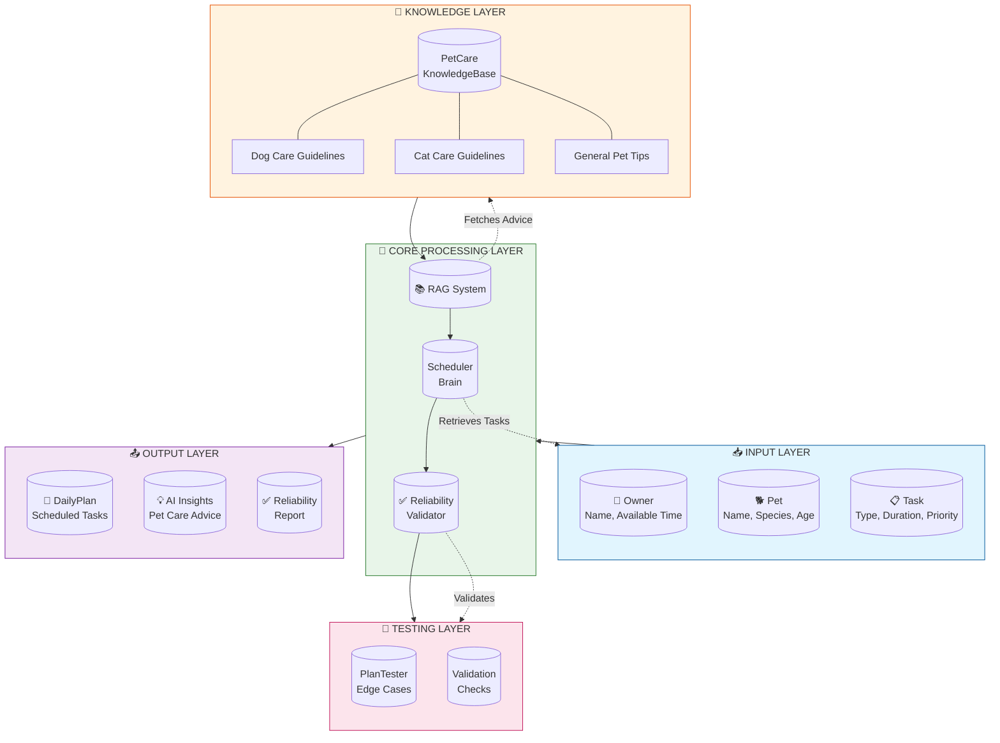

# PawPal+ System Architecture

## System Diagram with RAG & Reliability Integration

---

## Data Flow Description

### 📥 Input → Process → Output

| Stage | Component | Description |
|-------|-----------|-------------|
| **Input** | Owner, Pet, Task | User provides: name, available time, pet details, task list |
| **Process** | Scheduler | Retrieves all tasks, filters mandatory ones, ranks by priority |
| **Process** | RAG System | Retrieves relevant pet care advice from knowledge base |
| **Process** | Reliability Validator | Validates plan for feasibility, consistency, completeness |
| **Output** | DailyPlan | Scheduled tasks + AI insights + reliability report |

---

## Human & Testing Involvement

### 👤 Human Involvement (Checking AI Results)

1. **Owner Review**
   - User reviews generated schedule in Streamlit app
   - Can mark tasks as complete or skip them
   - Can adjust available time and regenerate

2. **Pet Care Decision**
   - AI provides advice but human makes final decisions
   - Can accept or ignore smart suggestions

### 🧪 Testing Involvement

1. **Automated Testing (PlanTester)**
   - Edge case testing: empty tasks, overflow, dependencies
   - Runs via `pytest tests/test_pawpal.py`

2. **Reliability Validation**
   - Time feasibility check: Does plan fit available time?
   - Consistency check: No duplicates, no zero-duration tasks
   - Completeness check: All mandatory tasks scheduled
   - Conflict check: No scheduling overlaps

3. **Manual Verification**
   - User can expand "AI Insights" section to verify advice
   - User can review "Reliability Check" metrics

---

## Component Details

### Core Components

| Component | Type | Responsibility |
|-----------|------|----------------|
| **Scheduler** | Agent | Organizes tasks into daily plan using priority & time constraints |
| **RAG Integration** | Retriever | Fetches relevant pet care advice from knowledge base |
| **ReliabilityValidator** | Evaluator | Validates plan reliability across multiple dimensions |
| **PlanTester** | Tester | Runs automated edge case tests |

### Knowledge Base (RAG)

- **Dog Care Guidelines**: Walking, feeding, playtime, grooming
- **Cat Care Guidelines**: Feeding, litter box, enrichment, vet visits
- **General Pet Tips**: Hydration, rest, general health

### Validation Categories

1. **Feasibility**: Plan fits within available time
2. **Consistency**: No duplicates or invalid tasks
3. **Completeness**: All mandatory tasks included
4. **Conflicts**: No scheduling overlaps